# Workflow

## Definitions

In systems engineering and software development lifecycles, these three acronyms represent critical **Control Gates** (or milestone reviews). They act as quality-assurance checkpoints that a project must pass before moving from the planning phase into actual production or coding.

Here is what they stand for:

### 1. SRR: System Requirements Review

* **What it means:** This milestone occurs at the very beginning of the technical process.
* **The Purpose:** It ensures that the development team and the stakeholders fully agree on *what* the software is supposed to do. The team reviews user needs, project scope, and system constraints to make sure the requirements are realistic, consistent, and testable before any architecture is designed.

### 2. PDR: Preliminary Design Review

* **What it means:** This milestone happens after the initial architecture has been drafted.
* **The Purpose:** It evaluates the high-level design and software architecture (such as choosing between microservices or a monolith, or selecting database types). The goal is to prove that the proposed design actually satisfies the system requirements established during the SRR, and that it is technically viable before deep-dive component design begins.

### 3. CDR: Critical Design Review

* **What it means:** This is the final review before full-scale manufacturing, coding, or implementation begins.
* **The Purpose:** It provides a granular, deep-dive evaluation of the detailed design (such as API schemas, specific database configurations, and detailed class diagrams). Passing the CDR means the design is officially "frozen" or baselined, giving the development teams the green light to begin full-scale coding and sprint execution with minimal risk of fundamental design changes.

### 4. CCB: Change Control Board

* **What it means:** A formal committee of cross-functional stakeholders (such as Product Owners, Lead Architects, DevOps Managers, and Business Analysts) who review and vote on proposed changes to a project's established baseline.
* **The Purpose:** In complex software systems, you cannot allow developers or stakeholders to change requirements, code architectures, or system scopes on a whim, as a single tweak can cause a massive ripple effect across the entire platform. The CCB acts as the ultimate gatekeeper. When a bug, gap, or feature request emerges, the CCB evaluates its impact on the schedule, budget, security, and system stability before giving the green light to implement the change or issue a waiver.

```mermaid
%%{init: {'theme': 'dark'}}%%
graph LR
    %% --- STYLING & CLASSES ---
    classDef vision fill:#2f3f58,stroke:#5f7a9b,stroke-width:2px,color:#e9eef5;
    classDef decomp fill:#3a4b66,stroke:#6f8fb4,stroke-width:2px,color:#e9eef5;
    classDef build fill:#2f4b47,stroke:#6da19a,stroke-width:2px,color:#e9f5f2;
    classDef verify fill:#3b5b56,stroke:#7fb3ab,stroke-width:2px,color:#e9f5f2;
    classDef ccb fill:#5a4a3d,stroke:#b08b6b,stroke-width:2px,color:#f7efe8;
    classDef ccbAction fill:#6a5849,stroke:#c29c7a,stroke-width:2px,color:#f7efe8;
    classDef gate fill:#5a5a44,stroke:#b7b08a,stroke-width:2px,color:#f3f1e6;

    %% --- LEFT SIDE: DECOMPOSITION (DOWNWARD FLOW) ---
    subgraph DECOMPOSITION ["Requirements Decomposition (The Downward Flow)"]
        L0[<b>Level 0: Product Vision & User Goals</b>]:::vision
        
        L0 --> SRR{<b>SRR</b>}:::gate
        
        SRR --> L1[<b>Level 1: Software System Requirements</b>]:::decomp
        
        L1 --> PDR{<b>PDR</b>}:::gate
        
        PDR --> L2[<b>Level 2: Architectural & Subsystem Specs</b>]:::decomp
        
        L2 --> CDR{<b>CDR</b>}:::gate
        
        CDR --> L3[<b>Level 3: Component Design Specifications</b>]:::decomp
    end

    %% --- RIGHT SIDE: VERIFICATION & VALIDATION (UPWARD FLOW) ---
    subgraph VERIFICATION ["Verification & Validation (The Upward Flow)"]
        BUILD[<b>Development / Coding Phase</b>]:::build
        
        L3 --> BUILD
        
        BUILD --> V3[<b>Unit & Component Testing</b>]:::verify
        
        V3 --> V2[<b>Integration & Subsystem Testing</b>]:::verify
        
        V2 --> V1[<b>System & End-to-End Testing</b>]:::verify
        
        V1 --> V0[<b>UAT & Product Delivery</b>]:::verify
    end

    %% --- BOTTOM: TRACEABILITY & FEEDBACK LOOP ---
    subgraph LOOP ["Traceability & Feedback Loop Mechanism"]
        GAP[<b>Identify Issue / Gap</b>]:::ccb
        
        TRACE[<b>Impact Analysis</b>]:::ccb
        
        CCB{"CCB"}:::ccb
        
        WAIVER[<b>Approve Waiver / Acceptance</b>]:::ccbAction
        
        REFACTOR[<b>Architecture Iteration / Re-baselining</b>]:::ccbAction
    end

    %% --- TRACEABILITY & FEEDBACK CONNECTIONS ---
    %% Connecting testing failures to the gap identification
    V3 -.->|Test Failure / Bug| GAP
    V2 -.->|Integration Breakage| GAP
    V1 -.->|Performance Bottleneck| GAP
    
    %% CCB Flow
    GAP --> TRACE
    TRACE --> CCB
    CCB -->|Option A| WAIVER
    CCB -->|Option B| REFACTOR
    
    %% Loop back up into the engineering chain
    REFACTOR -->|Iterate Back Up| L2
    WAIVER -->|Proceed with Risk| BUILD

    %% Bidirectional Traceability Links (Visual representation of mapping)
    L3 <-.->|Trace Matrix| L1
    L2 <-.->|Trace Matrix| L0
```

## Stage and Step Elaboration

### Decomposition Flow (Downward)

* **Level 0: Product Vision & User Goals** defines the business intent and user outcomes.
  * Example: Build a secure, scalable cloud ERP system.
* **SRR Gate (Specs Review)** validates that initial requirements are complete, feasible, and testable.
* **Level 1: Software System Requirements** captures measurable system targets.
  * Example: Handle 10k concurrent users and 99.9% uptime.
* **PDR Gate (Architecture Review)** confirms that the proposed architecture can satisfy Level 1 requirements.
* **Level 2: Architectural & Subsystem Specs** details service boundaries, technology choices, and subsystem behaviors.
  * Example: SQL vs NoSQL trade studies, authentication microservice boundaries.
* **CDR Gate (Detailed Design Review)** confirms detailed designs are implementation-ready.
* **Level 3: Component Design Specifications** defines component-level contracts and structures.
  * Example: OAuth token schema, database table indexing strategy.

### Verification and Validation Flow (Upward)

* **Development / Coding Phase** implements Level 3 designs in working software.
* **Unit & Component Testing** verifies code against component specifications.
* **Integration & Subsystem Testing** verifies interactions across APIs, services, and data stores.
* **System & End-to-End Testing** verifies system-wide behavior and non-functional performance targets.
* **UAT & Product Delivery** validates that delivered behavior matches business vision and user needs.

### Traceability and Feedback Loop

* **Identify Issue / Gap** records defects, requirement gaps, or unmet performance targets.
  * Example: Database load fails at 5k concurrent users.
* **Impact Analysis** uses traceability mapping to identify upstream/downstream effects.
* **CCB Decision** selects a controlled response.
* **Approve Waiver / Acceptance** accepts bounded risk with stakeholder approval.
  * Example: Accept a lower performance tier temporarily.
* **Architecture Iteration / Re-baselining** revises architecture, requirements, or design baseline.
  * Example: Redesign API boundaries or upgrade database infrastructure.
